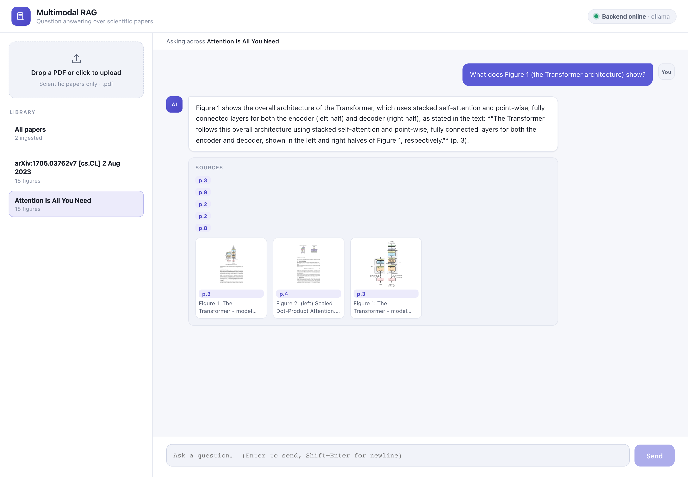
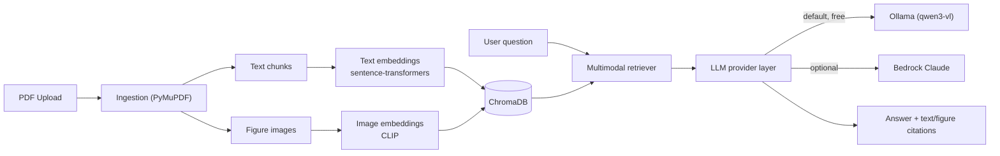

# Multimodal RAG for Scientific Papers

A **multimodal** Retrieval-Augmented Generation system for scientific papers. Upload a PDF and ask questions that are answered with citations to **both text passages and figures**. It runs **fully locally and free** by default (Ollama + open-source embeddings), with an optional high-quality **AWS Bedrock Claude** backend — swappable via a single environment variable.

## Demo

Asking *"What does Figure 1 (the Transformer architecture) show?"* over the "Attention Is All You Need" paper — the answer cites both text passages (by page) and the relevant figures:



## Why this project

Scientific papers are inherently multimodal — the key result is often *in a figure*, not the prose. A text-only RAG misses this. This system embeds figures into a CLIP space that is **jointly queryable by text**, so a question like *"What does Figure 2 show?"* retrieves the actual figure image and feeds it to a vision-capable LLM alongside the relevant text.

## Architecture



**Flow:** PDF → PyMuPDF extracts text (chunked) and figures (embedded rasters + full-page renders as a fallback so vector charts aren't lost) → text is embedded with `sentence-transformers`, figures with `open-clip` into a shared CLIP space → both stored in ChromaDB → a query is embedded for *both* collections, retrieves top text chunks + figures → a vision LLM answers with page citations.

## Tech stack

| Layer | Choice | Why |
|---|---|---|
| PDF parsing | **PyMuPDF** | Fast text + raster image extraction; page rendering catches vector figures |
| Text embeddings | **sentence-transformers** (`bge-small-en-v1.5`) | Strong, lightweight, fully local |
| Image embeddings | **open-clip** (`ViT-B-32`) | Encodes images *and* text into one space → text-to-figure retrieval |
| Vector store | **ChromaDB** (persistent, cosine) | Zero-config, local, two collections (text + figures) |
| LLM (default) | **Ollama** `qwen3-vl:8b` | Free, private, strong local vision-language model |
| LLM (optional) | **AWS Bedrock** Claude 3.5 Sonnet | Highest answer/figure-understanding quality |
| Backend | **FastAPI** + Uvicorn | Async API, auto OpenAPI docs |
| Frontend | **React + TypeScript + Vite** | Polished chat UI with inline figure citations |

## Design rationale

- **Pluggable LLM layer** (`backend/app/llm/`): a small `LLMProvider` protocol with `ollama` and `bedrock` implementations selected by `LLM_PROVIDER`. The repo clones-and-runs for free locally; swapping to Bedrock is one env var. This mirrors real forward-deployed work where you prototype locally and productionize on cloud.
- **True multimodal retrieval, not captions:** figures are embedded as *images* via CLIP (rather than only captioning them as text), so retrieval is grounded in visual content while still being queryable by a text question.
- **No-figure-left-behind ingestion:** many scientific figures are vector graphics that `get_images()` misses, so each page is also rendered to an image as a labeled fallback.
- **Graceful degradation:** if no vision model is pulled, retrieval still works and the API returns citations with a clear note instead of failing.

## Project layout

```
backend/app/
  config.py          # pydantic-settings (env-driven, local-first defaults)
  ingestion.py       # PyMuPDF text chunking + figure/page extraction
  embeddings.py      # TextEmbedder (ST) + ImageEmbedder (CLIP), lazy singletons
  vector_store.py    # ChromaDB wrapper: text + figure collections
  llm/               # base protocol, ollama_provider, bedrock_provider, factory
  rag.py             # ingest_paper() + answer_question() orchestration
  main.py            # FastAPI routes + CORS
frontend/            # Vite + React + TS chat UI (upload, sidebar, citations)
scripts/
  fetch_sample_papers.py  # download open-access arXiv PDFs
  smoke_test.py           # end-to-end ingestion + retrieval check
```

## Quickstart (local, free)

Prerequisites: [`uv`](https://github.com/astral-sh/uv), Node 18+, and [Ollama](https://ollama.com).

```bash
# 1. Install Python deps
uv sync

# 2. Configure (defaults to local Ollama, no edits needed)
cp .env.example .env

# 3. Pull a vision-capable model (one-time, ~6 GB)
ollama pull qwen3-vl:8b      # lighter alternative: ollama pull gemma3:4b

# 4. Run the backend (http://localhost:8000, docs at /docs)
uv run uvicorn backend.app.main:app --reload --port 8000

# 5. Run the frontend (http://localhost:5173) in another terminal
cd frontend && npm install && npm run dev
```

Open http://localhost:5173, upload a PDF, and ask away. Try the included sample:

```bash
uv run python scripts/fetch_sample_papers.py   # downloads "Attention Is All You Need" et al.
```

## Optional: AWS Bedrock (Claude)

For higher-quality answers, switch the provider — no code changes:

```bash
# in .env
LLM_PROVIDER=bedrock
AWS_REGION=us-east-1
BEDROCK_MODEL_ID=anthropic.claude-3-5-sonnet-20241022-v2:0
```

AWS credentials are read from the standard chain (env vars, `~/.aws/credentials`, or an IAM role). Ensure your account has access to the chosen Bedrock model.

## API

| Method | Route | Description |
|---|---|---|
| `POST` | `/papers` | Upload + ingest a PDF (multipart `file`) |
| `GET` | `/papers` | List ingested papers |
| `DELETE` | `/papers/{id}` | Remove a paper |
| `POST` | `/chat` | `{ question, paper_id? }` → answer + text & figure citations |
| `GET` | `/figures/{id}` | Serve a figure PNG |
| `GET` | `/health` | Status + active provider |

## Verify the pipeline

```bash
uv run python scripts/smoke_test.py
```

This ingests a sample paper, runs a text query and a figure-referencing query, and asserts citations are returned. If no Ollama model is pulled, it validates the full retrieval pipeline and skips only the generation step (with a clear message).

## License

MIT.
